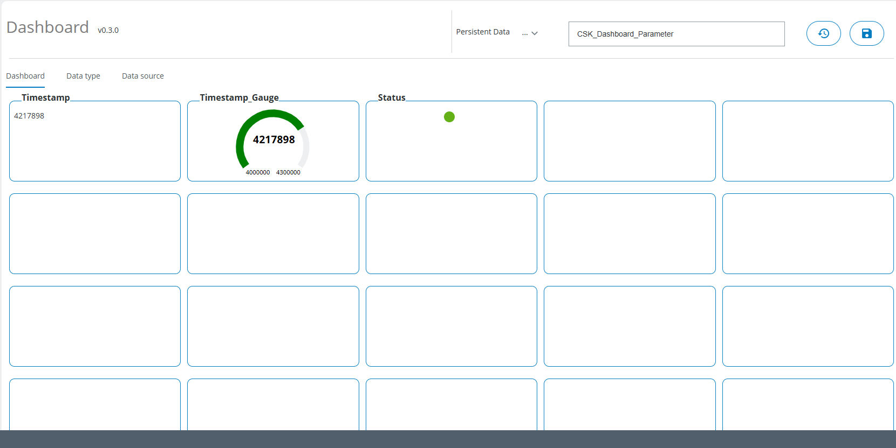

# CSK_Module_Dashboard

Module to dynamically show values provided by other SensorApps to show on a UI. 
Can be used via the CSK FlowConfig feature but can be configured manually via its UI as well.

## How to Run

For further information check out the [documentation](https://raw.githack.com/SICKAppSpaceCodingStarterKit/CSK_Module_Dashboard/main/docu/CSK_Module_Dashboard.html) in the folder "docu".

## Dependencies

To build this app via AppStudio / VS Code SICK AppSpace SDK its UI builder needs to use the extended control library, available e.g. [here](https://support.sick.com/sick-knowledgebase/article/?code=KA-10435) or [here](https://support.sick.com/sick-knowledgebase/article/?code=KA-10438):  

## Information

Tested on:
|Device|Firmware|Module version|
|--|--|--|
|SIM300|V1.1.0|V1.0.0|
|SICK AppEngine|V1.8.0|V1.0.0|

This module is part of the SICK AppSpace Coding Starter Kit developing approach.  
It is programmed in an object oriented way. Some of the modules use kind of "classes" in Lua to make it possible to reuse code / classes in other projects.  
In general it is not neccessary to code this way, but the architecture of this app can serve as a sample to be used especially for bigger projects and to make it easier to share code.  
Please check the [documentation](https://github.com/SICKAppSpaceCodingStarterKit/.github/blob/main/docu/SICKAppSpaceCodingStarterKit_Documentation.md) of CSK for further information.  

## Topics

Coding Starter Kit, CSK, Module, SICK-AppSpace, Dashboard, Visualize
